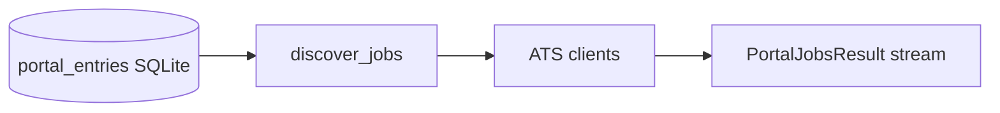

<p align="center">
  <strong>ATSKit</strong><br>
  <em>A Python toolkit for listing jobs across applicant tracking systems.</em>
</p>

<p align="center">
  <a href="https://github.com/nirmalhk7/atskit/actions/workflows/ci.yml"></a>
  <a href="https://github.com/nirmalhk7/atskit/releases"></a>
  <a href="https://www.python.org/downloads/"></a>
  <a href="LICENSE"></a>
</p>

---

**ATSKit** queries public ATS APIs for open job listings. Point it at a SQLite file with company portal metadata, and it **streams `JobListing` results per portal** as each board finishes — no server, no cron, no opinionated pipeline.

Use it as a standalone library in any Python project, shell script, or automation pipeline.

## Features

- **Nine ATS backends** — Greenhouse, Lever, Ashby, Gem, Workday, Apple, Amazon, Microsoft, American Express
- **Streaming discovery** — `discover_jobs()` yields `PortalJobsResult` per portal via `as_completed`, not batch-at-end
- **Caller-owned SQLite** — reads/writes only `portal_entries` (`status` flag included); bring your own DB path
- **Polite HTTP** — per-host rate limits, retries on 429/5xx, browser-like headers
- **URL intelligence** — classify job URLs into portal / slug / job id; clean URLs with optional query preservation
- **Portal population** — build or sync `portal_entries` from applied-job URLs
- **CLI included** — `atskit discover` and `atskit list` for quick smoke tests
- **Ships with `example.db`** — 471 real portal rows to try without setup

## Quick start

Install once — this registers the `atskit` command in your shell **and** the `atskit` Python module:

```bash
git clone https://github.com/nirmalhk7/atskit.git
cd atskit
pip install -e ".[dev,greenhouse]"
```

The repo ships with **`example.db`** (471 portal rows). No setup required.

### From bash (CLI)

Use the CLI for smoke tests and one-off runs. Output is human-readable lines per portal:

```bash
# Discover jobs across every portal in the DB
atskit discover --db example.db --max-workers 3

# Or set the DB path once in your shell
export ATSKIT_DB_PATH=example.db
atskit discover

# Spot-check a single board
atskit list --portal greenhouse --slug stripe
```

### From Python (library)

Use the API when you need structured `JobListing` objects — filtering, saving to your own DB, or piping into a pipeline:

```python
from pathlib import Path
import atskit

for result in atskit.discover_jobs(Path("example.db"), max_workers=3):
    if result.error:
        print(f"[ERR] {result.entry.name}: {result.error}")
        continue
    print(f"[OK] {result.entry.name}: {result.job_count} jobs")
    for job in result.jobs:
        print(f"  {job.title} — {job.apply_url}")
```

Both paths call the same `discover_jobs()` under the hood. See [docs/cli.md](docs/cli.md) for all flags.

## Install

| Method | Command |
|--------|---------|
| **Latest release** | `pip install "https://github.com/nirmalhk7/atskit/releases/latest/download/atskit-<version>-py3-none-any.whl"` |
| **From source** | `pip install git+https://github.com/nirmalhk7/atskit.git` |
| **Editable dev** | `pip install -e ".[dev,greenhouse]"` |

Wheels are published automatically on every `main` commit that touches Python files. See [docs/publishing.md](docs/publishing.md) for semver and release details.

Optional extras:

```bash
pip install "atskit[greenhouse]"   # trafilatura for better Greenhouse HTML extraction
pip install "atskit[dev]"          # pytest, responses
```

## How it works



1. Load company portals from `portal_entries` (`name`, `slug`, `portal`, `sample_url`, `status`)
2. Query each portal's public API in parallel (configurable workers)
3. Yield normalized `JobListing` objects as each portal completes
4. Optionally mark `last_scanned_date` to skip boards already scanned today
5. Skip any row where `status = 0`

ATSKit stops at job listings. Filtering, ranking, AI analysis, and application tracking are left to the consumer.

## Supported platforms

| Portal | Host examples |
|--------|---------------|
| `greenhouse` | `boards.greenhouse.io`, `*.greenhouse.io` |
| `lever` | `jobs.lever.co` |
| `ashby` | `jobs.ashbyhq.com` |
| `gem` | `jobs.gem.com` |
| `workday` | `*.myworkdayjobs.com` |
| `apple` | `jobs.apple.com` |
| `amazon` | `amazon.jobs` |
| `microsoft` | `apply.careers.microsoft.com` |
| `american_express` | `careers.americanexpress.com` |

Slug formats and URL parsing rules: [docs/portals.md](docs/portals.md).

## API snapshot

```python
import atskit

# Stream all portals in a DB
for result in atskit.discover_jobs("portals.db"):
    ...

# Single board
jobs = atskit.list_jobs("greenhouse", "stripe")
desc = atskit.fetch_description("greenhouse", "stripe", "123456")

# URL helpers
cls = atskit.classify_url("https://jobs.lever.co/acme/abc-123")

# Portal table CRUD
store = atskit.PortalStore("portals.db")
entries = atskit.load_portals("portals.db")
```

Full reference: [docs/api.md](docs/api.md).

## CLI

The `atskit` console script is installed with the package. Commands:

| Command | Purpose |
|---------|---------|
| `atskit discover` | Stream jobs from every portal in a SQLite DB |
| `atskit list --portal <p> --slug <s>` | List jobs for one board (debug / spot check) |

See **Quick start** above for examples. Full flag reference: [docs/cli.md](docs/cli.md).

## Documentation

| Guide | Description |
|-------|-------------|
| [Getting started](docs/getting-started.md) | Install, `example.db`, first run |
| [Architecture](docs/architecture.md) | Module map and design principles |
| [Database](docs/database.md) | `portal_entries` schema |
| [API reference](docs/api.md) | Public Python API |
| [Supported portals](docs/portals.md) | Slug formats per ATS |
| [Adding an ATS client](docs/adding-an-ats.md) | Contributor guide for new backends |
| [Publishing](docs/publishing.md) | CI, semver, GitHub Releases |

## Development

```bash
pip install -e ".[dev,greenhouse]"
pytest -q
```

Contributions welcome — especially new ATS clients. See [docs/adding-an-ats.md](docs/adding-an-ats.md).

## License

MIT — see [LICENSE](LICENSE).
